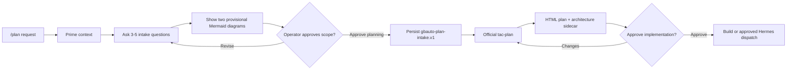

# Canonical `/plan` Lifecycle

This workflow is the sole orchestrator for durable GBAutomation planning.
Harness and expert routes may enter it with primed context, but they do not
copy, shorten, or recursively invoke it.

## Input contract

- `REQUEST`: the bounded planning request or summary.
- `ORIGIN`: `explicit_plan`, `durable_intent`, `expert_plan`,
  `expert_plan_build_improve`, `expert_studio`, `claude`, or `codex`.
- `ROUTE_DEPTH`: must be `0`.
- `DELEGATED_TO_PLAN`: must be `false`.
- Optional `EXPERTISE_PATH`: a canonical expert `expertise.md` already read by
  the adapter.

Reject a second entry when `ROUTE_DEPTH > 0` or `DELEGATED_TO_PLAN` is true.
The caller sets those fields before the one delegation so hook output cannot
route `/plan` into itself.

## State machine

### 1. Prime

1. Read the repository startup pointers in `AGENTS.md`.
2. Inspect current `origin/main`, directly relevant decisions, tests, hooks,
   source roots, generated projections, and runtime drift.
3. Query internal TAC reuse and profile-filtered Canopy evidence before making
   architecture or provider recommendations. When a target repository/profile
   exists, attach a bounded `tac-engineering-grounding.v1` packet with the
   profile/map/index hashes, qualified pattern IDs, gate IDs, deviations, or a
   typed no-match.
4. Record primed repository-relative sources. Never record secrets, raw prompt
   bodies, private URLs, credentials, or PII.

### 2. Intake confirmation

Ask three to five focused questions that collectively cover:

- outcome and measurable success;
- included scope and exclusions;
- authority and ownership boundaries;
- runtime activation or external-write boundaries; and
- implementation approval criteria.

If `REQUEST` already answers a question, restate the proposed answer and ask
the operator to confirm it. Never silently infer that intake is complete.

In the same response, show two request-specific Mermaid sources:

1. current-to-target transition; and
2. proposed target architecture.

Label both diagrams **provisional and non-canonical**. Summarize assumptions and
ask for explicit scope approval. Stop. This gate authorizes official planning
only, not implementation or dispatch.

### 3. Persist intake

After scope approval, create a versioned `gbauto-plan-intake.v1` receipt under
`second-brain/intelligence/planning-intakes/`. It contains:

- bounded request summary and base identity;
- primed repository-relative sources;
- three to five questions and confirmed answers;
- assumptions;
- the exact two provisional Mermaid sources with `canonical: false`;
- the scope decision and a separate pending implementation decision; and
- the resulting plan and architecture paths.

Validate with:

```text
python scripts/plan_intake.py validate <receipt.json>
```

### 4. Official `tac-plan`

Run Phase 0 internal reuse plus bounded external gap research. Then select and
execute the appropriate create/update workflow from `SKILL.md`.

The official workflow must:

- create the self-contained HTML-first plan;
- create and stamp `architecture-artifact.v1`;
- use canonical diagrams derived after approval, not silently promote the
  provisional diagrams;
- validate, publish, index, adopt, and read back the artifacts when available;
  and
- present the plan for a distinct implementation decision.

### 5. Implementation gate

Stop before any build or Hermes dispatch. Approval must bind:

- plan SHA-256;
- architecture SHA-256 and approved status;
- current base commit;
- exact phases or tasks; and
- explicit exclusions, including any live or destructive action.

The decision also binds the effective engineering profile ID/hash and
repository map ID/hash. Any profile, required-pattern, gate, or deviation
change invalidates the implementation decision.

Record the decision with `scripts/plan_intake.py decide`. Changes route back to
the official plan. Approval releases only the bound local build or separately
authorized `tac-hermes-dispatch`.


