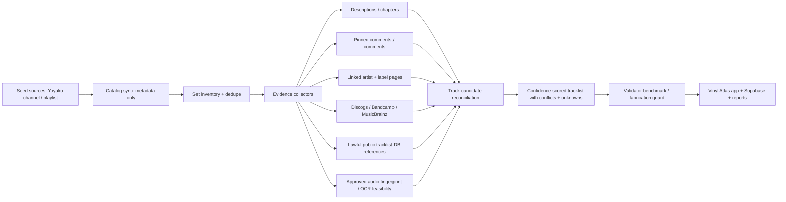

# TAC Plan / PRD — Vinyl Atlas DJ-set catalog and tracklist intelligence

Status: PRD/spec ready for TAC Lead review and Greg approval before implementation.

## 1. Request summary

Create a Vinyl Atlas extension that discovers DJ-set videos, inventories sets, recovers grounded tracklists/setlists, and expands from Yoyaku Record Store into adjacent DJ-set archives. This task produced planning and reconnaissance only: no full-catalog scrape, no media download, no cloud writes, and no implementation dispatch.

Seed sources:

- Yoyaku Record Store channel: https://www.youtube.com/@yoyakurecordstore/videos
- Yoyaku DJ Sets playlist: https://www.youtube.com/playlist?list=PLIqVrn4DemiF0nMWjbaZF4tTFpuj5-4ZN

## 2. Repo-boundary decision

Decision: build into the existing canonical repo, not a replacement repo.

Evidence:

- Local repo: `/Users/greg/repos/vinyl-atlas`
- Remote: `https://github.com/gbauto/vinyl-atlas.git`
- GitHub owner/repo: `gbauto/vinyl-atlas`
- Visibility: private
- Default branch: `main`
- Remote HEAD: `refs/remotes/origin/main`
- Active state: not archived; latest local commits `b39b02b chore: refresh full repo verification artifacts`, `350043b feat: initialize vinyl atlas full repo app`; GitHub pushed `2026-06-11T19:37:56Z`.
- License: no GitHub `licenseInfo`, no local `LICENSE*` file found. Add a license decision before external distribution.
- Current architecture: React + TypeScript + Vite, Supabase schema, local weekly reports, source registry/KB expansion, Three.js graph exploration.
- Repo-local citations: `/Users/greg/repos/vinyl-atlas/README.md`, `/Users/greg/repos/vinyl-atlas/package.json`, `/Users/greg/repos/vinyl-atlas/docs/app-spec.md`, `/Users/greg/repos/vinyl-atlas/docs/ci-cd.md`.

Boundary rule:

- `gbauto/vinyl-atlas` owns product code, data contracts, local fixtures, tests, reports, and app docs.
- `gbautomation` owns TAC planning artifacts, retrieval receipts, dispatch cards, and public plan/report publication.
- Do not put live client/customer WIP or private external credentials into the GBAutomation control repo.

## 3. Goals

- Reproducibly inventory Yoyaku in-store/DJ-set videos from public/official metadata paths.
- Store source-backed set records with stable IDs, provenance, timestamps, artist/source fields, confidence, and sync receipts.
- Recover tracklist candidates with evidence, not guesses.
- Preserve unknown tracks as unknown.
- Rank adjacent DJ-set archives by catalog size, metadata quality, genre fit, and recoverability.
- Turn the work into an approved TAC profile-team build graph only after Greg approves this plan.

## 4. Non-goals

- No unauthorized media redistribution.
- No bulk audio download by default.
- No claim of complete tracklists without source evidence.
- No bypass of robots/ToS/copyright boundaries.
- No replacement repo unless `gbauto/vinyl-atlas` is explicitly superseded by Greg.
- No cloud/Supabase writes until implementation is separately approved.

## 5. TAC grounding

Canonical TAC sources used:

- `second-brain/resources/tac-creed.md` — Stop Coding, Adopt Agent Perspective, Always Add Feedback Loops, One Agent One Purpose, Target Zero-Touch Engineering.
- `second-brain/resources/tac-prompt-format.yaml` — level 4 delegation prompt structure, reuse citation, validation gates, Canopy evidence contract.
- `second-brain/knowledge/tac-kb.md` via `scripts/tac_knowledge_query.py`.
- `tac-inventory/` via `scripts/retrieve_tac_components.py`.

Relevant tactics:

- Tactic 2 Adopt Agent Perspective: every setlist agent starts blind, so each track claim must carry source URL, evidence type, timestamp span, and confidence.
- Tactic 5 Always Add Feedback Loops: benchmark 10 real videos, precision/coverage metrics, no-fabrication validator.
- Tactic 6 One Agent, One Prompt, One Purpose: separate catalog, provenance, reconciliation, audio/OCR, data-contract, and validation agents.
- Tactic 7 Target Zero-Touch Engineering: design incremental sync + receipts + validators before scaling beyond Yoyaku.
- Tactic 8 Prioritize Agentics: invest in reusable ingestion/reconciliation agents rather than one-off scraping scripts.

## 6. TAC component and Canopy reuse evidence

Inventory retrieval artifact:

- `second-brain/intelligence/tac-retrievals/2026-07-19-vinyl-atlas-dj-set-catalog-t_ae901c01-components.json`
- Components scanned: `1518`; match count: `1`.

Inventory matches / no-match evidence:

- `agent-experts:apps/orchestrator_db/README.md` (reference; score 4) — Reach for this component when you need to understand, extend, or debug the orchestrator's database layer — it is the declared single source of truth for schema and Pydantic models across all orchestrator apps. In TAC terms, the database is a high-risk, high-co...

KB retrieval artifact:

- `second-brain/intelligence/tac-retrievals/2026-07-19-vinyl-atlas-dj-set-catalog-t_ae901c01-kb.json`
- KB matched: `139`; returned: `10`.

Selected TAC KB evidence:

- `multi-agent-orchestration:apps/orchestrator_db/migrations/1_agents.sql` (migration; second-brain/knowledge/tac-kb.md:2083) — Reach for this migration when you need to bootstrap the agents registry table in a multi-agent orchestration system — it defines the canonical schema for tracking agent identity, runtime state (status/session_i...
- `multi-agent-orchestration:apps/orchestrator_db/migrations/2_prompts.sql` (migration; second-brain/knowledge/tac-kb.md:2085) — Reach for this migration when you need a durable, versioned schema contract for the prompts that flow between engineers and the orchestrator agent — it captures both the content and provenance (author enum, ses...
- `agentic-prompt-engineering:.claude/commands/experts/cc_hook_expert/cc_hook_expert_build.md` (command; second-brain/knowledge/tac-kb.md:3454) — Reach for this command when you need to translate a hook specification into a production-ready Claude Code hook implementation — it encodes all UV script standards, security requirements, and output patterns so...
- `agentic-prompt-engineering:.claude/commands/experts/cc_hook_expert/cc_hook_expert_plan.md` (command; second-brain/knowledge/tac-kb.md:3458) — Reach for this component when you need to plan a new Claude Code hook feature before writing any code — it provides a structured expert prompt that guides analysis of existing hook infrastructure, event selecti...
- `agentic-prompt-engineering:.claude/commands/plan_vite_vue.md` (command; second-brain/knowledge/tac-kb.md:3466) — Reach for this command when you need a structured, repo-aware implementation roadmap before writing a single line of Vue code — it gates implementation behind an explicit plan artifact. It is especially valuabl...
- `agentic-prompt-engineering:.claude/output-styles/verbose-bullet-points.md` (output-style; second-brain/knowledge/tac-kb.md:3494) — Reach for this output-style component when you need Claude to structure responses as scannable, hierarchically-nested bullet points rather than prose — ideal for task summaries, step-by-step instructions, or mu...
- `building-specialized-agents:.claude/commands/experts/cc_hook_expert/cc_hook_expert_build.md` (command; second-brain/knowledge/tac-kb.md:3213) — Reach for this command when you have a finished hook spec and need an agent that already knows UV script layout, settings.json wiring, stdin/stdout exit-code contracts, and security rules — so you never have to...
- `building-specialized-agents:.claude/commands/experts/cc_hook_expert/cc_hook_expert_plan.md` (command; second-brain/knowledge/tac-kb.md:3217) — Reach for this command at the start of any new Claude Code hook feature when you need a rigorous, architecture-aware spec before writing code. It encodes the full hook lifecycle, event model, security patterns,...

Repo-local reusable components:

- `vinyl-atlas:src/lib/intelligence.ts` — current source registry / KB model to extend.
- `vinyl-atlas:supabase/migrations/001_vinyl_intelligence.sql` — current Supabase tables for sources, reports, feed events.
- `vinyl-atlas:scripts/run-weekly-reports.ts` — existing recurring intelligence-report pattern.
- `vinyl-atlas:docs/app-spec.md` — repository/template consultation requirement already embedded in app docs.
- `vinyl-atlas:docs/ci-cd.md` — verification commands and agent bootstrap contract.

Filtered Canopy context:

- Source inventory: `artifacts/canopy-snippet-index/canopy-snippets.json`; `snippet_count=47`; filter `profile_team=tac-hermes`, domains/tags: `prd`, `tac`, `kanban`, `artifact`, `supabase`, `data-contract`, `validation`, `receipt`.
- Selected snippets for future cards:
  - `source-backed-requirements` — `resources/skills/canopy/snippets/prd.md`; requires evidence/confidence/span refs.
  - `build-gate` — `resources/skills/canopy/snippets/tac.md`; requires plan path and validation command evidence.
  - `prd-dispatch-trace` — `resources/skills/canopy/snippets/kanban.md`; requires task/run IDs, team attribution, validation gate, and receipt.
  - `generated-output-storage` — `resources/skills/canopy/snippets/artifact.md`; requires registry/storage receipts and secret rejection.
  - `datafeed-manager` — `resources/skills/canopy/snippets/supabase-datafeed.md`; useful only if/when Supabase write lane is approved.
- Guard: no global Canopy dump; future cards get max 3 snippets / 2400 bytes per `tac-prompt-format.yaml`.

## 7. Yoyaku reconnaissance appendix

Metadata method:

- `yt-dlp --flat-playlist --dump-single-json` on the public channel and seed playlist.
- `yt-dlp --skip-download --dump-json --no-playlist` for metadata-only samples/candidate records.
- No media files downloaded.
- Artifacts:
  - `second-brain/intelligence/yoyaku-vinyl-atlas/yoyaku-channel-videos-flat.json`
  - `second-brain/intelligence/yoyaku-vinyl-atlas/yoyaku-dj-sets-playlist-flat.json`
  - `second-brain/intelligence/yoyaku-vinyl-atlas/yoyaku-instore-catalog-summary.json`
  - `second-brain/intelligence/yoyaku-vinyl-atlas/sample-metadata.jsonl`

Counts from reproducible public metadata:

- Channel flat video count: `2480`.
- Seed playlist `Yoyaku DJ Sets` count: `16`.
- Title-filtered in-store candidate count: `137`.
- In-store date range: `20160511` to `20260716`.
- Last 2 years from 2026-07-20: `104` in-store candidates.
- Last 3 years from 2026-07-20: `124` in-store candidates.
- With descriptions: `130` / `137`.
- With chapters: `7` / `137`.
- By year: `{'2026': 46, '2025': 35, '2024': 37, '2023': 10, '2018': 1, '2017': 4, '2016': 4}`.

10-video sample:

- `Qf8Dkfmo-58` — 20260716 — Yoyaku Instore Session with  Alich — 67.8 min — description 465 chars, chapters 0; https://www.youtube.com/watch?v=Qf8Dkfmo-58
- `BbwqvXePRcU` — 20260714 — Yoyaku Instore Session with Zaltan — 50.9 min — description 389 chars, chapters 0; https://www.youtube.com/watch?v=BbwqvXePRcU
- `TCcPM5S8AxM` — 20260710 — Yoyaku Instore Session with Satoshi Tomiie & Tomoki Tamura — 69.8 min — description 475 chars, chapters 0; https://www.youtube.com/watch?v=TCcPM5S8AxM
- `VUf9uytnaf4` — 20260709 — Yoyaku Instore Session with Yama Music — 64.6 min — description 470 chars, chapters 0; https://www.youtube.com/watch?v=VUf9uytnaf4
- `tnpTY-IvYVE` — 20260707 — Yoyaku Instore Session with Mai Iachetti — 67.1 min — description 460 chars, chapters 0; https://www.youtube.com/watch?v=tnpTY-IvYVE
- `viUlUwf7iD0` — 20260618 — Yoyaku Instore Session with DJ Senc — 58.6 min — description 445 chars, chapters 0; https://www.youtube.com/watch?v=viUlUwf7iD0
- `F_1jLD7GKvw` — 20260403 — Yoyaku Instore Session with Fort Romeau — 65.0 min — description 466 chars, chapters 0; https://www.youtube.com/watch?v=F_1jLD7GKvw
- `aI3cXBOjoOU` — 20251123 — Yoyaku Instore Session with Nina Kraviz — 103.5 min — description 419 chars, chapters 0; https://www.youtube.com/watch?v=aI3cXBOjoOU
- `G7Lj9TBJLww` — 20250212 — Yoyaku instore session with Lazerman — 72.1 min — description 575 chars, chapters 0; https://www.youtube.com/watch?v=G7Lj9TBJLww
- `9oTpSraY7xw` — 20240802 — Yoyaku instore session with Stekke — 61.0 min — description 388 chars, chapters 0; https://www.youtube.com/watch?v=9oTpSraY7xw

Recon finding:

- Yoyaku descriptions mostly contain store/social/artist links, not tracklists.
- Chapters are rare across the candidate corpus (`7` / `137`), so v1 must expect low first-party setlist coverage and lean on comments, linked artist/label pages, external tracklist databases when lawful, and reconciliation workflows.

## 8. Data contracts

Core entities:

- `dj_sources`: source/channel/archive registry.
- `dj_sets`: one row per video/set, keyed by source + platform video ID.
- `dj_set_evidence`: every evidence item used for catalog or track claims.
- `track_candidates`: candidate tracks with evidence links and confidence.
- `tracklist_reconciliations`: merged ordered tracklist view with conflict status.
- `sync_runs`: API/query receipts, quota usage, errors, and incremental cursor state.
- `validation_benchmarks`: locked 10-video sample, expected evidence coverage, known unknowns, precision/coverage runs.

Minimum fields for every track identification:

```yaml
set_id: string
track_candidate_id: string | null
artist: string | null
title: string | null
label: string | null
catalog_number: string | null
timestamp_start_sec: number | null
timestamp_end_sec: number | null
source_url: string
evidence_type: description | chapter | pinned_comment | comment | linked_page | discogs | bandcamp | musicbrainz | public_tracklist_db | audio_fingerprint | ocr | human_review
source_quote_or_selector: string | null
confidence: 0.0-1.0
conflict_status: none | conflicting_sources | timestamp_conflict | duplicate_candidate | unresolved
human_review_status: not_needed | needed | approved | rejected
created_by_agent: string
created_at: datetime
```

Fabrication guard:

- If evidence is absent, output `unknown`, not a best guess.
- If multiple sources conflict, preserve all candidates and set `conflict_status`.
- If confidence is below threshold, route to human/agent reconciliation.

## 9. Extraction and reconciliation pipeline



Layered evidence order:

1. YouTube Data API metadata: title, description, thumbnails, duration, upload date, channel, playlist membership.
2. YouTube chapters and pinned/visible comments where API/ToS allow.
3. Linked Yoyaku, artist, label, SoundCloud, Instagram/linktree pages as metadata pointers.
4. Discogs, MusicBrainz, Bandcamp, label catalogs, artist pages for candidate track facts.
5. Public tracklist databases such as 1001Tracklists only when lawful/accessible and with robots/ToS respected.
6. Approved audio fingerprinting against legal/local snippets only after copyright/storage policy is signed off.
7. OCR of visible record labels/track IDs from frames only if permitted, sampling-limited, and stored as evidence pointers or derived text, not redistributed media.
8. Human/agent reconciliation for low-confidence or conflicting claims.

Confidence model:

- 0.90-1.00: official description/chapter or artist/label page with timestamp.
- 0.75-0.89: corroborated external source + plausible timestamp/comment evidence.
- 0.50-0.74: single unofficial source, comment, OCR/fingerprint candidate needing review.
- <0.50: unresolved candidate; keep as `unknown` in public tracklist view.

## 10. YouTube API, quota, rate, ToS, copyright, and storage policy

Preferred official path:

- YouTube Data API v3 for channels, playlists, videos, comments where available and approved.
- Use playlistItems/videos endpoints for stable pagination and ETags.
- Use search only for discovery gaps because it is higher-cost and less deterministic.
- Track quota units per sync run and fail closed before daily cap.

Fallbacks:

- Public metadata reconnaissance with `yt-dlp` is acceptable for planning/verification but implementation should prefer official APIs where practical.
- oEmbed/RSS can provide lightweight sanity checks but not complete catalog sync.

Rate and incremental sync:

- Store source cursor: playlist page token, last seen video IDs, channel upload playlist ID, ETag, latest upload date.
- Deduplicate by `(platform, video_id)` and secondary normalized title/date.
- Re-sync recent window daily/weekly; historical backfill in bounded pages with receipts.
- Respect robots/ToS for non-YouTube pages; crawl with low concurrency and source-specific adapters.

Copyright/storage:

- Default storage is metadata/evidence pointers, normalized text quotes/selectors, thumbnails only if rights/terms permit, and no full video/audio copying.
- Audio/OCR lane requires explicit approval, bounded clip policy, and deletion/retention receipts.
- No public redistribution of copyrighted sets or extracted audio.

Secrets:

- YouTube API key, Supabase service role, Discogs token, and any fingerprint API credentials stay server-side only.
- Browser only sees public-safe anon keys and metadata that has passed redaction.

## 11. Adjacent-source discovery lane

Preliminary ranked source classes:

- Boiler Room: catalog=Very large; metadata=medium-high; genre_fit=high; recoverability=high. Good v1 source after Yoyaku; public channel archive, frequent artist context, variable tracklists.
- HÖR BERLIN: catalog=Very large; metadata=medium; genre_fit=high; recoverability=medium. High genre fit and set volume; recoverability depends on comments/external IDs.
- NTS: catalog=Very large; metadata=high; genre_fit=high; recoverability=high. Strong official metadata and show pages; audio archive norms differ from YouTube video ingestion.
- Rinse FM: catalog=Large; metadata=high; genre_fit=high; recoverability=high. Radio archive with show pages and artist metadata; good provenance lane.
- The Lot Radio: catalog=Large; metadata=medium-high; genre_fit=high; recoverability=medium-high. Strong DJ set corpus, often useful descriptions and external pages.
- Keep Hush: catalog=Large; metadata=medium; genre_fit=high; recoverability=medium. Club/live set corpus; comments and descriptions matter.
- My Analog Journal: catalog=Large; metadata=high; genre_fit=medium; recoverability=high. Excellent visual record/track cues and curated descriptions; slightly broader genre fit.
- Defected Broadcasting House: catalog=Large; metadata=high; genre_fit=medium; recoverability=high. More house/mainstream but strong metadata and official pages.
- Resident Advisor: catalog=Medium; metadata=high; genre_fit=high; recoverability=medium-high. RA mixes/pages are valuable adjacent evidence, not always YouTube-native.
- Dekmantel / Dimensions / Cercle / Mixmag Lab: catalog=Medium-large; metadata=medium-high; genre_fit=medium; recoverability=medium. Use after top radio/video archives; event/show metadata strong but genre fit varies.
- Trommel / Meoko / Nightclubber.ro / feeder sound / SlothBoogie: catalog=Medium; metadata=medium; genre_fit=very high; recoverability=medium. High minimal/underground fit; likely smaller corpus but useful tracklist evidence.
- Bassiani/Horoom, Club Guesthouse, Kiosk Radio, Refuge Worldwide, Djoon, Crack: catalog=Medium; metadata=medium; genre_fit=medium-high; recoverability=medium. Validate exact official archive shape before ingestion; good expansion candidates.

Expansion rule:

- Rank by `(catalog_size * 0.25) + (metadata_quality * 0.25) + (genre_fit * 0.25) + (recoverability * 0.25)`.
- Require one source adapter profile per source class; never assume YouTube-shaped metadata for radio archives.
- Store source-specific ToS/robots/copyright notes before enabling sync.

## 12. Execution route and agent/team shape

Route: `profile-team` after PRD approval.

Recommended staged cards after Greg approves:

- tac-director: Orchestrate approved build graph, preserve TAC Lead gates, own closeout receipts.
- tac-researcher / docs API: Verify YouTube Data API, oEmbed/RSS fallback, Discogs/MusicBrainz/Bandcamp/1001Tracklists legality and robots constraints.
- tac-builder / catalog: Implement incremental YouTube catalog sync only after approval; no media download; metadata/evidence pointers only.
- tac-builder / provenance: Implement link-following evidence capture for descriptions, comments, pinned comments, artist/label pages, Discogs/Bandcamp references.
- tac-builder / reconciliation: Implement confidence-scored track candidate merger with unknown-safe output; never fill gaps from vibes.
- tac-researcher / audio-OCR: Prototype feasibility on 3 approved clips with fingerprint/OCR only if copyright/storage policy is approved.
- tac-architect: Own schema/contracts, Supabase migration plan, event/report observability, and repo-boundary ADR.
- tac-validator: Create 10-video benchmark, fabrication guard, precision/coverage scoring, smoke commands.
- tac-ops: Publish reports/receipts, repo PR, Netlify report, and post-run artifact registry.
- tac-self-improve: After implementation only: update reusable Vinyl Atlas/TAC skills if new safe ingestion pattern is validated.

Model tier metadata:

- Sol / Extra High: TAC Lead + architect ambiguity, repo boundary, data contract, copyright/safety gate.
- Terra / High: implementation of sync/reconciliation/tests.
- Luna / Light-Medium: deterministic metadata reconnaissance, report publication, smoke receipts.

## 13. Files expected to change in implementation

In `gbauto/vinyl-atlas`:

- `src/lib/intelligence.ts` — add DJ-set source registry model.
- `src/lib/youtubeCatalog.ts` — new approved YouTube metadata adapter.
- `src/lib/tracklistEvidence.ts` — evidence normalization + confidence scoring.
- `src/lib/reconciliation.ts` — conflict-safe tracklist merger.
- `src/lib/*.test.ts` — unit tests for dedupe, confidence, conflict, unknown-safe output.
- `supabase/migrations/002_dj_set_intelligence.sql` — additive tables only; do not rewrite existing migration.
- `scripts/sync-yoyaku-catalog.ts` — metadata-only sync with dry-run and receipt mode.
- `scripts/benchmark-tracklist-recovery.ts` — 10-video benchmark runner.
- `docs/dj-set-intelligence-prd.md` — repo-local version of this PRD.
- `docs/runbook.md`, `docs/ci-cd.md`, `.github/workflows/*` — update validation after implementation.

In `gbautomation`:

- Planning/report artifacts under `second-brain/intelligence/reports/vinyl-atlas-dj-set-catalog/`.
- TAC retrieval artifacts under `second-brain/intelligence/tac-retrievals/`.
- Yoyaku reconnaissance artifacts under `second-brain/intelligence/yoyaku-vinyl-atlas/`.
- Kanban card receipts if/when implementation is dispatched.

## 14. Validation matrix

- Repo boundary: verify `gh repo view gbauto/vinyl-atlas`, remote URL, default branch, license status.
- Catalog sync: reproduce channel count, playlist count, title-filtered candidate count, 2-year/3-year horizon.
- Dedupe: duplicate video IDs across channel/playlist collapse to one set record.
- Evidence schema: every track candidate has source URL, evidence type, timestamp range or null, confidence, conflict status.
- Unknown-safe behavior: benchmark includes missing-track cases; output remains unknown.
- Precision/coverage: report per video: claimed tracks, evidence-backed claims, conflict count, unknown count, precision proxy, coverage proxy.
- No-fabrication validator: fail if any public tracklist row has artist/title without evidence URL.
- API quota: dry-run computes expected YouTube quota before writes.
- Copyright: no media files in repo, artifacts, or Supabase storage by default.
- Browser/app smoke: app builds, benchmark report renders, console has no blocking errors.

Implementation smoke commands after build approval:

```bash
cd /Users/greg/repos/vinyl-atlas
npm test
npm run build
npm run reports:weekly
npm run schema:print >/tmp/vinyl-schema.sql
npm run sync:yoyaku -- --dry-run --limit 10 --receipt data/reports/yoyaku-sync-smoke.json
npm run benchmark:tracklists -- --sample docs/fixtures/yoyaku-10-video-benchmark.json --receipt data/reports/yoyaku-tracklist-benchmark.json
```

## 15. Observability and receipts

Receipts required:

- `sync_runs` row or local JSON for every catalog sync.
- `tracklist_recovery_run` local JSON/Supabase row for every benchmark/prod recovery run.
- Netlify/HTML report receipt for planning outputs.
- Kanban parent closeout receipt before terminal parent closes.
- Artifact registry entry for Markdown/HTML/PDF deliverables where applicable.

This planning run receipt:

- Markdown: `/Users/greg/repos/gbautomation/second-brain/intelligence/reports/vinyl-atlas-dj-set-catalog/2026-07-19-vinyl-atlas-dj-set-catalog-tac-plan.md`
- HTML: `/Users/greg/repos/gbautomation/second-brain/intelligence/reports/vinyl-atlas-dj-set-catalog/2026-07-19-vinyl-atlas-dj-set-catalog-tac-plan.html`
- Recon appendix: `second-brain/intelligence/yoyaku-vinyl-atlas/yoyaku-instore-catalog-summary.json`
- Retrieval: `second-brain/intelligence/tac-retrievals/2026-07-19-vinyl-atlas-dj-set-catalog-t_ae901c01-components.json`

## 16. Risks and approval gates

Approval gates before implementation:

- Greg approves this plan and repo boundary.
- License decision for `gbauto/vinyl-atlas` if distribution scope expands.
- YouTube API credential/storage decision.
- External source robots/ToS review for each adapter.
- Audio/OCR lane separately approved with clip/retention/copyright policy.
- Supabase/cloud writes separately approved.

Main risks:

- Yoyaku first-party metadata has weak tracklist coverage.
- Comment/pinned-comment access may be API/ToS/quota constrained.
- Public tracklist DBs may prohibit scraping or require manual linking only.
- Audio fingerprint/OCR could create copyright/storage risk if not tightly bounded.
- Low-confidence models can hallucinate; validator must block unevidenced claims.

## 17. Recommended next owner

Next owner after approval: `tac-director` creates the profile-team implementation graph with `tac-architect` and `tac-researcher` first, then builders only after schema/API/legal gates are explicit.

Recommended next action for Greg: approve, revise, or reject this PRD. If approved, TAC Lead should create downstream Kanban cards rather than continuing inline.
