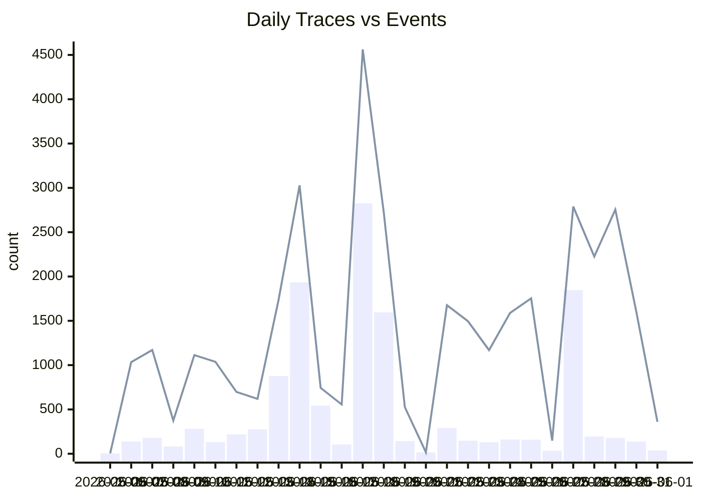

# Enhanced Langfuse Trace Analysis

## Executive Summary

- Generated: 2026-06-01 06:42:06Z
- Project scope: `Gbautomation / gbauto`
- Trace rows: **12,659**
- Embedded observation/event ids: **37,498**
- Traces with token usage populated: **0**
- Missing/weak working-directory source: **6,163 traces** (48.7%)
- Unclassified harness after enhanced rules: **18 traces** (0.1%)

The important categorization change is that `tool_call:main` and Telegram-shaped traces are treated as Hermes-related instead of `<none>`, and GitHub Actions/Linear cron are normalized to `gha`. Hermes still needs better producer-side attributes because most high-volume spans carry only OTel `service.name=unknown_service`.

## By Langfuse Project

| Value | Traces | Events | Trace % | Event % | Lat p50 | Lat p95 | Cost | In tok | Out tok | Top trace names |
|---|--:|--:|--:|--:|--:|--:|--:|--:|--:|---|
| `Gbautomation / gbauto` | 12,659 | 37,498 | 100.0% | 100.0% | 1.97s | 173.44s | $0.0014 | 0 | 0 | hermes_conversation:main (3,204), tool_call:main (1,444), hermes:main · telegram dm 6777263736 (648) |

## By Normalized Agent Harness

| Value | Traces | Events | Trace % | Event % | Lat p50 | Lat p95 | Cost | In tok | Out tok | Top trace names |
|---|--:|--:|--:|--:|--:|--:|--:|--:|--:|---|
| `hermes` | 4,438 | 28,839 | 35.1% | 76.9% | 30.40s | 298.03s | $0.0005 | 0 | 0 | hermes_conversation:main (3,204), hermes:main · telegram dm 6777263736 (648), hermes:main · telegram (249) |
| `claude-code` | 6,462 | 6,701 | 51.0% | 17.9% | 1.49s | 3.84s | $0.0009 | 0 | 0 | claude-code · gbautomation@main · claude-sonnet-4-6 (225), claude-code · auto_gba-383-add-docs-agent-team-trace-vali@auto/gba-383-add-docs-agent-team-trace-vali · claude-sonnet-4-6 (169), claude-code · auto_gba-481-sunset-obsidian-approval-path@auto/gba-481-sunset-obsidian-approval-path · claude-sonnet-4-6 (164) |
| `hermes-tool-call-unlinked` | 1,444 | 1,444 | 11.4% | 3.9% | 0.44s | 3.31s | $0.0000 | 0 | 0 | tool_call:main (1,444) |
| `gha` | 265 | 265 | 2.1% | 0.7% | 3.62s | 800.54s | $0.0000 | 0 | 0 | linear-cron:github-actions (233), linear-cron:local (32) |
| `missing-name` | 14 | 213 | 0.1% | 0.6% | 115.67s | 399.46s | $0.0000 | 0 | 0 | <none> (14) |
| `openclaw` | 26 | 26 | 0.2% | 0.1% | 4.01s | 5.37s | $0.0000 | 0 | 0 | openclaw_daily-client-logs (26) |
| `tac-local` | 6 | 6 | 0.0% | 0.0% | 0.11s | 0.14s | $0.0000 | 0 | 0 | tac-build-report:local (6) |
| `other` | 4 | 4 | 0.0% | 0.0% | 0.00s | 0.00s | $0.0000 | 0 | 0 | win-probe-windows-1778115961 (1), cc.api_request (1), diag-probe-finalize (1) |

## Hermes Breakdown: Detail Bucket

| Value | Traces | Events | Trace % | Event % | Lat p50 | Lat p95 | Cost | In tok | Out tok | Top trace names |
|---|--:|--:|--:|--:|--:|--:|--:|--:|--:|---|
| `conversation / profile=main` | 3,192 | 16,040 | 25.2% | 42.8% | 6.13s | 248.49s | $0.0000 | 0 | 0 | hermes_conversation:main (3,192) |
| `<non-hermes>` | 6,777 | 7,215 | 53.5% | 19.2% | 1.51s | 4.90s | $0.0009 | 0 | 0 | linear-cron:github-actions (233), claude-code · gbautomation@main · claude-sonnet-4-6 (225), claude-code · auto_gba-383-add-docs-agent-team-trace-vali@auto/gba-383-add-docs-agent-team-trace-vali · claude-sonnet-4-6 (169) |
| `turn / platform=telegram / bot=gbautomation_agent_bot / profile=main / chat=6777263736` | 648 | 6,224 | 5.1% | 16.6% | 73.62s | 536.00s | $0.0000 | 0 | 0 | hermes:main · telegram dm 6777263736 (648) |
| `turn / platform=telegram / bot=gbautomation_agent_bot / profile=main` | 249 | 2,852 | 2.0% | 7.6% | 111.76s | 341.04s | $0.0000 | 0 | 0 | hermes:main · telegram (249) |
| `turn / platform=telegram` | 15 | 1,630 | 0.1% | 4.3% | 52.01s | 35183.53s | $0.0005 | 0 | 0 | Hermes turn (15) |
| `turn / platform=cron / bot=gbautomation_agent_bot / profile=main` | 234 | 1,448 | 1.8% | 3.9% | 38.50s | 249.32s | $0.0000 | 0 | 0 | hermes:main · cron (234) |
| `tool_call` | 1,444 | 1,444 | 11.4% | 3.9% | 0.44s | 3.31s | $0.0000 | 0 | 0 | tool_call:main (1,444) |
| `turn / platform=cli / bot=gbautomation_agent_bot / profile=main` | 57 | 462 | 0.5% | 1.2% | 3.47s | 560.53s | $0.0000 | 0 | 0 | hermes:main · cli (57) |
| `conversation` | 29 | 141 | 0.2% | 0.4% | 28.97s | 205.36s | $0.0000 | 0 | 0 | hermes_conversation (17), hermes_conversation:main (12) |
| `turn / platform=telegram / bot=gbautomation_agent_bot / profile=main / chat=8253376283` | 9 | 26 | 0.1% | 0.1% | 8.11s | 31.61s | $0.0000 | 0 | 0 | hermes:main · telegram dm 8253376283 (9) |
| `turn / platform=curator / bot=gbautomation_agent_bot / profile=main` | 1 | 11 | 0.0% | 0.0% | 60.38s | 60.38s | $0.0000 | 0 | 0 | hermes:main · curator (1) |
| `other` | 2 | 2 | 0.0% | 0.0% | 0.00s | 0.00s | $0.0000 | 0 | 0 | hermes_tags_test_sdk:main (1), hermes_test_helper:main (1) |
| `turn / platform=cli` | 1 | 2 | 0.0% | 0.0% | 2.40s | 2.40s | $0.0000 | 0 | 0 | Hermes turn (1) |
| `turn / platform=telegram / bot=gbautomation_agent_bot / profile=main / chat=-1003998344776` | 1 | 1 | 0.0% | 0.0% | 2.07s | 2.07s | $0.0000 | 0 | 0 | hermes:main · telegram dm -1003998344776 (1) |

## Hermes Breakdown: Platform

| Value | Traces | Events | Trace % | Event % | Lat p50 | Lat p95 | Cost | In tok | Out tok | Top trace names |
|---|--:|--:|--:|--:|--:|--:|--:|--:|--:|---|
| `<missing>` | 4,667 | 17,627 | 36.9% | 47.0% | 4.34s | 219.82s | $0.0000 | 0 | 0 | hermes_conversation:main (3,204), tool_call:main (1,444), hermes_conversation (17) |
| `telegram` | 922 | 10,733 | 7.3% | 28.6% | 89.34s | 481.77s | $0.0005 | 0 | 0 | hermes:main · telegram dm 6777263736 (648), hermes:main · telegram (249), Hermes turn (15) |
| `<non-hermes>` | 6,777 | 7,215 | 53.5% | 19.2% | 1.51s | 4.90s | $0.0009 | 0 | 0 | linear-cron:github-actions (233), claude-code · gbautomation@main · claude-sonnet-4-6 (225), claude-code · auto_gba-383-add-docs-agent-team-trace-vali@auto/gba-383-add-docs-agent-team-trace-vali · claude-sonnet-4-6 (169) |
| `cron` | 234 | 1,448 | 1.8% | 3.9% | 38.50s | 249.32s | $0.0000 | 0 | 0 | hermes:main · cron (234) |
| `cli` | 58 | 464 | 0.5% | 1.2% | 3.38s | 560.53s | $0.0000 | 0 | 0 | hermes:main · cli (57), Hermes turn (1) |
| `curator` | 1 | 11 | 0.0% | 0.0% | 60.38s | 60.38s | $0.0000 | 0 | 0 | hermes:main · curator (1) |

## Hermes Breakdown: Chat ID

| Value | Traces | Events | Trace % | Event % | Lat p50 | Lat p95 | Cost | In tok | Out tok | Top trace names |
|---|--:|--:|--:|--:|--:|--:|--:|--:|--:|---|
| `<missing>` | 5,224 | 24,032 | 41.3% | 64.1% | 4.72s | 247.97s | $0.0005 | 0 | 0 | hermes_conversation:main (3,204), tool_call:main (1,444), hermes:main · telegram (249) |
| `<non-hermes>` | 6,777 | 7,215 | 53.5% | 19.2% | 1.51s | 4.90s | $0.0009 | 0 | 0 | linear-cron:github-actions (233), claude-code · gbautomation@main · claude-sonnet-4-6 (225), claude-code · auto_gba-383-add-docs-agent-team-trace-vali@auto/gba-383-add-docs-agent-team-trace-vali · claude-sonnet-4-6 (169) |
| `6777263736` | 648 | 6,224 | 5.1% | 16.6% | 73.62s | 536.00s | $0.0000 | 0 | 0 | hermes:main · telegram dm 6777263736 (648) |
| `8253376283` | 9 | 26 | 0.1% | 0.1% | 8.11s | 31.61s | $0.0000 | 0 | 0 | hermes:main · telegram dm 8253376283 (9) |
| `-1003998344776` | 1 | 1 | 0.0% | 0.0% | 2.07s | 2.07s | $0.0000 | 0 | 0 | hermes:main · telegram dm -1003998344776 (1) |

## By Working Directory / Repo / Process Source

| Value | Traces | Events | Trace % | Event % | Lat p50 | Lat p95 | Cost | In tok | Out tok | Top trace names |
|---|--:|--:|--:|--:|--:|--:|--:|--:|--:|---|
| `<missing>` | 6,163 | 30,720 | 48.7% | 81.9% | 5.42s | 252.36s | $0.0005 | 0 | 0 | hermes_conversation:main (3,176), tool_call:main (1,444), hermes:main · telegram dm 6777263736 (648) |
| `gbautomation` | 259 | 392 | 2.0% | 1.0% | 2.13s | 6.65s | $0.0009 | 0 | 0 | claude-code · gbautomation@main · claude-sonnet-4-6 (225), claude-code · gbautomation@main (25), Codex Windows graph smoke (3) |
| `auto_gba-383-add-docs-agent-team-trace-vali` | 271 | 271 | 2.1% | 0.7% | 1.19s | 2.37s | $0.0000 | 0 | 0 | claude-code · auto_gba-383-add-docs-agent-team-trace-vali@auto/gba-383-add-docs-agent-team-trace-vali · claude-sonnet-4-6 (169), claude-code · auto_gba-383-add-docs-agent-team-trace-vali@auto/gba-383-add-docs-agent-team-trace-vali (102) |
| `auto_gba-455-standardize-tac-build-receipt` | 204 | 204 | 1.6% | 0.5% | 1.27s | 2.94s | $0.0000 | 0 | 0 | claude-code · auto_gba-455-standardize-tac-build-receipt@auto/gba-455-standardize-tac-build-receipt · claude-sonnet-4-6 (101), claude-code · auto_gba-455-standardize-tac-build-receipt@auto/gba-455-standardize-tac-build-receipt · claude-haiku-4-5-20251001 (93), claude-code · auto_gba-455-standardize-tac-build-receipt@auto/gba-455-standardize-tac-build-receipt (10) |
| `auto_gba-397-create-hermes-profile-gbautoma` | 197 | 196 | 1.6% | 0.5% | 1.28s | 3.34s | $0.0000 | 0 | 0 | claude-code · auto_gba-397-create-hermes-profile-gbautoma@auto/gba-397-create-hermes-profile-gbautoma · claude-haiku-4-5-20251001 (100), claude-code · auto_gba-397-create-hermes-profile-gbautoma@auto/gba-397-create-hermes-profile-gbautoma · claude-sonnet-4-6 (93), claude-code · auto_gba-397-create-hermes-profile-gbautoma@auto/gba-397-create-hermes-profile-gbautoma (4) |
| `auto_gba-434-add-ask-user-choice-tool-expos` | 191 | 191 | 1.5% | 0.5% | 1.12s | 2.48s | $0.0000 | 0 | 0 | claude-code · auto_gba-434-add-ask-user-choice-tool-expos@auto/gba-434-add-ask-user-choice-tool-expos · claude-haiku-4-5-20251001 (120), claude-code · auto_gba-434-add-ask-user-choice-tool-expos@auto/gba-434-add-ask-user-choice-tool-expos · claude-sonnet-4-6 (69), claude-code · auto_gba-434-add-ask-user-choice-tool-expos@auto/gba-434-add-ask-user-choice-tool-expos (2) |
| `auto_gba-454-mandatory-tests-ci-gate-3-tabl` | 183 | 183 | 1.4% | 0.5% | 1.33s | 2.63s | $0.0000 | 0 | 0 | claude-code · auto_gba-454-mandatory-tests-ci-gate-3-tabl@auto/gba-454-mandatory-tests-ci-gate-3-tabl · claude-sonnet-4-6 (96), claude-code · auto_gba-454-mandatory-tests-ci-gate-3-tabl@auto/gba-454-mandatory-tests-ci-gate-3-tabl · claude-haiku-4-5-20251001 (77), claude-code · auto_gba-454-mandatory-tests-ci-gate-3-tabl@auto/gba-454-mandatory-tests-ci-gate-3-tabl (10) |
| `auto_gba-481-sunset-obsidian-approval-path` | 180 | 180 | 1.4% | 0.5% | 2.02s | 7.64s | $0.0000 | 0 | 0 | claude-code · auto_gba-481-sunset-obsidian-approval-path@auto/gba-481-sunset-obsidian-approval-path · claude-sonnet-4-6 (164), claude-code · auto_gba-481-sunset-obsidian-approval-path@auto/gba-481-sunset-obsidian-approval-path (16) |
| `auto_gba-483-jason-workspace-cleanup-tier-1` | 175 | 175 | 1.4% | 0.5% | 1.51s | 2.64s | $0.0000 | 0 | 0 | claude-code · auto_gba-483-jason-workspace-cleanup-tier-1@auto/gba-483-jason-workspace-cleanup-tier-1 · claude-sonnet-4-6 (126), claude-code · auto_gba-483-jason-workspace-cleanup-tier-1@auto/gba-483-jason-workspace-cleanup-tier-1 · claude-haiku-4-5-20251001 (43), claude-code · auto_gba-483-jason-workspace-cleanup-tier-1@auto/gba-483-jason-workspace-cleanup-tier-1 (6) |
| `auto_gba-489-phase-1b-vendor-resources-lib` | 153 | 153 | 1.2% | 0.4% | 1.44s | 2.98s | $0.0000 | 0 | 0 | claude-code · auto_gba-489-phase-1b-vendor-resources-lib@auto/gba-489-phase-1b-vendor-resources-lib · claude-sonnet-4-6 (120), claude-code · auto_gba-489-phase-1b-vendor-resources-lib@auto/gba-489-phase-1b-vendor-resources-lib · claude-haiku-4-5-20251001 (23), claude-code · auto_gba-489-phase-1b-vendor-resources-lib@auto/gba-489-phase-1b-vendor-resources-lib (10) |
| `auto_gba-447-universal-skill-hook-auto-regi` | 151 | 151 | 1.2% | 0.4% | 2.01s | 5.96s | $0.0000 | 0 | 0 | claude-code · auto_gba-447-universal-skill-hook-auto-regi@auto/gba-447-universal-skill-hook-auto-regi · claude-sonnet-4-6 (149), claude-code · auto_gba-447-universal-skill-hook-auto-regi@auto/gba-447-universal-skill-hook-auto-regi (2) |
| `auto_gba-461-hermes-profile-dbforge-dedicat` | 149 | 149 | 1.2% | 0.4% | 1.87s | 3.42s | $0.0000 | 0 | 0 | claude-code · auto_gba-461-hermes-profile-dbforge-dedicat@auto/gba-461-hermes-profile-dbforge-dedicat · claude-sonnet-4-6 (145), claude-code · auto_gba-461-hermes-profile-dbforge-dedicat@auto/gba-461-hermes-profile-dbforge-dedicat (4) |
| `auto_gba-422-inbox-2026-05-13-tac-self-impr` | 145 | 145 | 1.1% | 0.4% | 1.38s | 2.05s | $0.0000 | 0 | 0 | claude-code · auto_gba-422-inbox-2026-05-13-tac-self-impr@auto/gba-422-inbox-2026-05-13-tac-self-impr · claude-sonnet-4-6 (91), claude-code · auto_gba-422-inbox-2026-05-13-tac-self-impr@auto/gba-422-inbox-2026-05-13-tac-self-impr · claude-haiku-4-5-20251001 (52), claude-code · auto_gba-422-inbox-2026-05-13-tac-self-impr@auto/gba-422-inbox-2026-05-13-tac-self-impr (2) |
| `auto_gba-423-inbox-2026-05-14-automation-pl` | 143 | 143 | 1.1% | 0.4% | 1.56s | 3.31s | $0.0000 | 0 | 0 | claude-code · auto_gba-423-inbox-2026-05-14-automation-pl@auto/gba-423-inbox-2026-05-14-automation-pl · claude-sonnet-4-6 (141), claude-code · auto_gba-423-inbox-2026-05-14-automation-pl@auto/gba-423-inbox-2026-05-14-automation-pl (2) |
| `auto_gba-403-create-hermes-profile-gbautoma` | 136 | 136 | 1.1% | 0.4% | 1.29s | 2.72s | $0.0000 | 0 | 0 | claude-code · auto_gba-403-create-hermes-profile-gbautoma@auto/gba-403-create-hermes-profile-gbautoma · claude-sonnet-4-6 (75), claude-code · auto_gba-403-create-hermes-profile-gbautoma@auto/gba-403-create-hermes-profile-gbautoma · claude-haiku-4-5-20251001 (55), claude-code · auto_gba-403-create-hermes-profile-gbautoma@auto/gba-403-create-hermes-profile-gbautoma (6) |
| `auto_gba-484-phase-1-4-extract-linear-auton` | 128 | 128 | 1.0% | 0.3% | 1.27s | 1.97s | $0.0000 | 0 | 0 | claude-code · auto_gba-484-phase-1-4-extract-linear-auton@auto/gba-484-phase-1-4-extract-linear-auton · claude-sonnet-4-6 (97), claude-code · auto_gba-484-phase-1-4-extract-linear-auton@auto/gba-484-phase-1-4-extract-linear-auton · claude-haiku-4-5-20251001 (29), claude-code · auto_gba-484-phase-1-4-extract-linear-auton@auto/gba-484-phase-1-4-extract-linear-auton (2) |
| `auto_gba-441-hermes-architecture-diagrams-4` | 122 | 122 | 1.0% | 0.3% | 1.66s | 2.89s | $0.0000 | 0 | 0 | claude-code · auto_gba-441-hermes-architecture-diagrams-4@auto/gba-441-hermes-architecture-diagrams-4 · claude-sonnet-4-6 (120), claude-code · auto_gba-441-hermes-architecture-diagrams-4@auto/gba-441-hermes-architecture-diagrams-4 (2) |
| `auto_gba-442-roadmap-one-pager-brand-locked` | 121 | 121 | 1.0% | 0.3% | 1.54s | 3.38s | $0.0000 | 0 | 0 | claude-code · auto_gba-442-roadmap-one-pager-brand-locked@auto/gba-442-roadmap-one-pager-brand-locked · claude-sonnet-4-6 (113), claude-code · auto_gba-442-roadmap-one-pager-brand-locked@auto/gba-442-roadmap-one-pager-brand-locked · claude-haiku-4-5-20251001 (6), claude-code · auto_gba-442-roadmap-one-pager-brand-locked@auto/gba-442-roadmap-one-pager-brand-locked (2) |
| `auto_gba-323-task-wiki-maintenance-daily-cr` | 120 | 120 | 0.9% | 0.3% | 1.37s | 2.33s | $0.0000 | 0 | 0 | claude-code · auto_gba-323-task-wiki-maintenance-daily-cr@auto/gba-323-task-wiki-maintenance-daily-cr · claude-sonnet-4-6 (85), claude-code · auto_gba-323-task-wiki-maintenance-daily-cr@auto/gba-323-task-wiki-maintenance-daily-cr · claude-haiku-4-5-20251001 (33), claude-code · auto_gba-323-task-wiki-maintenance-daily-cr@auto/gba-323-task-wiki-maintenance-daily-cr (2) |
| `auto_gba-382-add-docs-agent-team-trace-vali` | 117 | 117 | 0.9% | 0.3% | 0.22s | 2.17s | $0.0000 | 0 | 0 | claude-code · auto_gba-382-add-docs-agent-team-trace-vali@auto/gba-382-add-docs-agent-team-trace-vali · claude-sonnet-4-6 (66), claude-code · auto_gba-382-add-docs-agent-team-trace-vali@auto/gba-382-add-docs-agent-team-trace-vali (51) |
| `claude-code-direct` | 54 | 115 | 0.4% | 0.3% | 4.60s | 155.85s | $0.0000 | 0 | 0 | hermes_conversation:main (28), run-step-blobs_upload (5), hermes:main · cli (3) |
| `auto_gba-487-phase-3-4-first-install-jid527` | 114 | 114 | 0.9% | 0.3% | 1.50s | 2.59s | $0.0000 | 0 | 0 | claude-code · auto_gba-487-phase-3-4-first-install-jid527@auto/gba-487-phase-3-4-first-install-jid527 · claude-sonnet-4-6 (63), claude-code · auto_gba-487-phase-3-4-first-install-jid527@auto/gba-487-phase-3-4-first-install-jid527 · claude-haiku-4-5-20251001 (47), claude-code · auto_gba-487-phase-3-4-first-install-jid527@auto/gba-487-phase-3-4-first-install-jid527 (4) |
| `auto_gba-482-hermes-cron-runner-support-arg` | 111 | 111 | 0.9% | 0.3% | 1.28s | 2.75s | $0.0000 | 0 | 0 | claude-code · auto_gba-482-hermes-cron-runner-support-arg@auto/gba-482-hermes-cron-runner-support-arg · claude-haiku-4-5-20251001 (64), claude-code · auto_gba-482-hermes-cron-runner-support-arg@auto/gba-482-hermes-cron-runner-support-arg · claude-sonnet-4-6 (45), claude-code · auto_gba-482-hermes-cron-runner-support-arg@auto/gba-482-hermes-cron-runner-support-arg (2) |
| `sylvan-hills` | 107 | 107 | 0.8% | 0.3% | 1.22s | 2.23s | $0.0000 | 0 | 0 | claude-code · sylvan-hills@main · claude-opus-4-7 (66), claude-code · sylvan-hills@main · claude-haiku-4-5-20251001 (37), claude-code · sylvan-hills@main (4) |
| `auto_gba-419-inbox-2026-05-13-hermes-tac-pi` | 106 | 106 | 0.8% | 0.3% | 1.59s | 5.00s | $0.0000 | 0 | 0 | claude-code · auto_gba-419-inbox-2026-05-13-hermes-tac-pi@auto/gba-419-inbox-2026-05-13-hermes-tac-pi · claude-sonnet-4-6 (65), claude-code · auto_gba-419-inbox-2026-05-13-hermes-tac-pi@auto/gba-419-inbox-2026-05-13-hermes-tac-pi · claude-haiku-4-5-20251001 (39), claude-code · auto_gba-419-inbox-2026-05-13-hermes-tac-pi@auto/gba-419-inbox-2026-05-13-hermes-tac-pi (2) |
| `auto_gba-420-inbox-2026-05-13-gbautomation` | 105 | 105 | 0.8% | 0.3% | 1.34s | 2.45s | $0.0000 | 0 | 0 | claude-code · auto_gba-420-inbox-2026-05-13-gbautomation@auto/gba-420-inbox-2026-05-13-gbautomation · claude-sonnet-4-6 (103), claude-code · auto_gba-420-inbox-2026-05-13-gbautomation@auto/gba-420-inbox-2026-05-13-gbautomation (2) |
| `auto_gba-460-harden-claude-with-hermes-auth` | 102 | 102 | 0.8% | 0.3% | 1.71s | 2.81s | $0.0000 | 0 | 0 | claude-code · auto_gba-460-harden-claude-with-hermes-auth@auto/gba-460-harden-claude-with-hermes-auth · claude-sonnet-4-6 (98), claude-code · auto_gba-460-harden-claude-with-hermes-auth@auto/gba-460-harden-claude-with-hermes-auth (4) |
| `auto_gba-470-hiringcafe-apply-llm-fallback` | 94 | 94 | 0.7% | 0.3% | 1.61s | 3.89s | $0.0000 | 0 | 0 | claude-code · auto_gba-470-hiringcafe-apply-llm-fallback@auto/gba-470-hiringcafe-apply-llm-fallback · claude-sonnet-4-6 (69), claude-code · auto_gba-470-hiringcafe-apply-llm-fallback@auto/gba-470-hiringcafe-apply-llm-fallback · claude-haiku-4-5-20251001 (23), claude-code · auto_gba-470-hiringcafe-apply-llm-fallback@auto/gba-470-hiringcafe-apply-llm-fallback (2) |
| `/Users/greg/.openclaw/workspace` | 93 | 93 | 0.7% | 0.2% | 1.95s | 2.80s | $0.0000 | 0 | 0 | claude-code · workspace · claude-opus-4-7 (55), claude-code · workspace · claude-haiku-4-5-20251001 (30), claude-code · workspace (8) |
| `auto_gba-386-inbox-2026-05-13-gbautomation` | 93 | 93 | 0.7% | 0.2% | 1.37s | 3.04s | $0.0000 | 0 | 0 | claude-code · auto_gba-386-inbox-2026-05-13-gbautomation@auto/gba-386-inbox-2026-05-13-gbautomation · claude-sonnet-4-6 (66), claude-code · auto_gba-386-inbox-2026-05-13-gbautomation@auto/gba-386-inbox-2026-05-13-gbautomation · claude-haiku-4-5-20251001 (25), claude-code · auto_gba-386-inbox-2026-05-13-gbautomation@auto/gba-386-inbox-2026-05-13-gbautomation (2) |
| `auto_gba-379-add-docs-agent-team-trace-vali` | 92 | 92 | 0.7% | 0.2% | 1.28s | 2.48s | $0.0000 | 0 | 0 | claude-code · auto_gba-379-add-docs-agent-team-trace-vali@auto/gba-379-add-docs-agent-team-trace-vali · claude-sonnet-4-6 (62), claude-code · auto_gba-379-add-docs-agent-team-trace-vali@auto/gba-379-add-docs-agent-team-trace-vali (30) |
| `auto_gba-402-write-fluff-classifier-fabrica` | 91 | 91 | 0.7% | 0.2% | 1.69s | 3.52s | $0.0000 | 0 | 0 | claude-code · auto_gba-402-write-fluff-classifier-fabrica@auto/gba-402-write-fluff-classifier-fabrica · claude-sonnet-4-6 (77), claude-code · auto_gba-402-write-fluff-classifier-fabrica@auto/gba-402-write-fluff-classifier-fabrica · claude-haiku-4-5-20251001 (12), claude-code · auto_gba-402-write-fluff-classifier-fabrica@auto/gba-402-write-fluff-classifier-fabrica (2) |
| `auto_gba-439-agent-team-yaml-spec-canonical` | 91 | 91 | 0.7% | 0.2% | 1.23s | 1.98s | $0.0000 | 0 | 0 | claude-code · auto_gba-439-agent-team-yaml-spec-canonical@auto/gba-439-agent-team-yaml-spec-canonical · claude-sonnet-4-6 (70), claude-code · auto_gba-439-agent-team-yaml-spec-canonical@auto/gba-439-agent-team-yaml-spec-canonical · claude-haiku-4-5-20251001 (19), claude-code · auto_gba-439-agent-team-yaml-spec-canonical@auto/gba-439-agent-team-yaml-spec-canonical (2) |
| `auto_gba-446-tac-must-not-fabricate-proof-c` | 91 | 91 | 0.7% | 0.2% | 1.53s | 2.79s | $0.0000 | 0 | 0 | claude-code · auto_gba-446-tac-must-not-fabricate-proof-c@auto/gba-446-tac-must-not-fabricate-proof-c · claude-sonnet-4-6 (63), claude-code · auto_gba-446-tac-must-not-fabricate-proof-c@auto/gba-446-tac-must-not-fabricate-proof-c · claude-haiku-4-5-20251001 (26), claude-code · auto_gba-446-tac-must-not-fabricate-proof-c@auto/gba-446-tac-must-not-fabricate-proof-c (2) |
| `auto_gba-443-service-tier-sales-deck-10-sli` | 91 | 90 | 0.7% | 0.2% | 1.58s | 2.74s | $0.0000 | 0 | 0 | claude-code · auto_gba-443-service-tier-sales-deck-10-sli@auto/gba-443-service-tier-sales-deck-10-sli · claude-sonnet-4-6 (81), claude-code · auto_gba-443-service-tier-sales-deck-10-sli@auto/gba-443-service-tier-sales-deck-10-sli (6), claude-code · auto_gba-443-service-tier-sales-deck-10-sli@auto/gba-443-service-tier-sales-deck-10-sli · claude-haiku-4-5-20251001 (4) |
| `auto_gba-384-inbox-2026-05-13-gbautomation` | 87 | 87 | 0.7% | 0.2% | 2.18s | 3.71s | $0.0000 | 0 | 0 | claude-code · auto_gba-384-inbox-2026-05-13-gbautomation@auto/gba-384-inbox-2026-05-13-gbautomation · claude-sonnet-4-6 (85), claude-code · auto_gba-384-inbox-2026-05-13-gbautomation@auto/gba-384-inbox-2026-05-13-gbautomation (2) |
| `auto_gba-405-netlify-skill-for-serving-arti` | 79 | 79 | 0.6% | 0.2% | 1.52s | 2.15s | $0.0000 | 0 | 0 | claude-code · auto_gba-405-netlify-skill-for-serving-arti@auto/gba-405-netlify-skill-for-serving-arti · claude-sonnet-4-6 (48), claude-code · auto_gba-405-netlify-skill-for-serving-arti@auto/gba-405-netlify-skill-for-serving-arti · claude-haiku-4-5-20251001 (29), claude-code · auto_gba-405-netlify-skill-for-serving-arti@auto/gba-405-netlify-skill-for-serving-arti (2) |
| `auto_gba-394-run-phase-1-5-gmail-poller-smo` | 78 | 78 | 0.6% | 0.2% | 2.01s | 5.72s | $0.0000 | 0 | 0 | claude-code · auto_gba-394-run-phase-1-5-gmail-poller-smo@auto/gba-394-run-phase-1-5-gmail-poller-smo · claude-sonnet-4-6 (49), claude-code · auto_gba-394-run-phase-1-5-gmail-poller-smo@auto/gba-394-run-phase-1-5-gmail-poller-smo · claude-haiku-4-5-20251001 (27), claude-code · auto_gba-394-run-phase-1-5-gmail-poller-smo@auto/gba-394-run-phase-1-5-gmail-poller-smo (2) |
| `auto_gba-480-morning-brief-promote-2-min-te` | 75 | 75 | 0.6% | 0.2% | 2.13s | 4.87s | $0.0000 | 0 | 0 | claude-code · auto_gba-480-morning-brief-promote-2-min-te@auto/gba-480-morning-brief-promote-2-min-te · claude-sonnet-4-6 (73), claude-code · auto_gba-480-morning-brief-promote-2-min-te@auto/gba-480-morning-brief-promote-2-min-te (2) |
| `auto_gba-421-inbox-2026-05-13-tac-data-laye` | 74 | 74 | 0.6% | 0.2% | 1.88s | 3.86s | $0.0000 | 0 | 0 | claude-code · auto_gba-421-inbox-2026-05-13-tac-data-laye@auto/gba-421-inbox-2026-05-13-tac-data-laye · claude-sonnet-4-6 (72), claude-code · auto_gba-421-inbox-2026-05-13-tac-data-laye@auto/gba-421-inbox-2026-05-13-tac-data-laye (2) |
| `auto_gba-464-smoke-test-gate-for-hermes-bin` | 72 | 72 | 0.6% | 0.2% | 2.41s | 4.53s | $0.0000 | 0 | 0 | claude-code · auto_gba-464-smoke-test-gate-for-hermes-bin@auto/gba-464-smoke-test-gate-for-hermes-bin · claude-sonnet-4-6 (70), claude-code · auto_gba-464-smoke-test-gate-for-hermes-bin@auto/gba-464-smoke-test-gate-for-hermes-bin (2) |
| `auto_gba-414-inbox-plan-netlify-html-brande` | 70 | 70 | 0.6% | 0.2% | 1.23s | 2.66s | $0.0000 | 0 | 0 | claude-code · auto_gba-414-inbox-plan-netlify-html-brande@auto/gba-414-inbox-plan-netlify-html-brande · claude-haiku-4-5-20251001 (40), claude-code · auto_gba-414-inbox-plan-netlify-html-brande@auto/gba-414-inbox-plan-netlify-html-brande · claude-sonnet-4-6 (28), claude-code · auto_gba-414-inbox-plan-netlify-html-brande@auto/gba-414-inbox-plan-netlify-html-brande (2) |
| `auto_gba-444-second-telegram-channel-for-ge` | 67 | 67 | 0.5% | 0.2% | 1.29s | 2.46s | $0.0000 | 0 | 0 | claude-code · auto_gba-444-second-telegram-channel-for-ge@auto/gba-444-second-telegram-channel-for-ge · claude-sonnet-4-6 (46), claude-code · auto_gba-444-second-telegram-channel-for-ge@auto/gba-444-second-telegram-channel-for-ge · claude-haiku-4-5-20251001 (19), claude-code · auto_gba-444-second-telegram-channel-for-ge@auto/gba-444-second-telegram-channel-for-ge (2) |
| `auto_gba-474-hourly-job-stats-telegram-ping` | 66 | 66 | 0.5% | 0.2% | 2.00s | 3.84s | $0.0000 | 0 | 0 | claude-code · auto_gba-474-hourly-job-stats-telegram-ping@auto/gba-474-hourly-job-stats-telegram-ping · claude-sonnet-4-6 (64), claude-code · auto_gba-474-hourly-job-stats-telegram-ping@auto/gba-474-hourly-job-stats-telegram-ping (2) |
| `claude-code` | 45 | 65 | 0.4% | 0.2% | 0.11s | 8.25s | $0.0000 | 0 | 0 | tac-team-runner-verifier:local (20), tac-build-report:local (17), linear-cron-localtest:local (4) |

## By Trace Name

| Value | Traces | Events | Trace % | Event % | Lat p50 | Lat p95 | Cost | In tok | Out tok | Top trace names |
|---|--:|--:|--:|--:|--:|--:|--:|--:|--:|---|
| `hermes_conversation:main` | 3,204 | 16,103 | 25.3% | 42.9% | 6.17s | 248.49s | $0.0000 | 0 | 0 | hermes_conversation:main (3,204) |
| `hermes:main · telegram dm 6777263736` | 648 | 6,224 | 5.1% | 16.6% | 73.62s | 536.00s | $0.0000 | 0 | 0 | hermes:main · telegram dm 6777263736 (648) |
| `hermes:main · telegram` | 249 | 2,852 | 2.0% | 7.6% | 111.76s | 341.04s | $0.0000 | 0 | 0 | hermes:main · telegram (249) |
| `Hermes turn` | 16 | 1,632 | 0.1% | 4.4% | 51.08s | 35183.53s | $0.0005 | 0 | 0 | Hermes turn (16) |
| `hermes:main · cron` | 234 | 1,448 | 1.8% | 3.9% | 38.50s | 249.32s | $0.0000 | 0 | 0 | hermes:main · cron (234) |
| `tool_call:main` | 1,444 | 1,444 | 11.4% | 3.9% | 0.44s | 3.31s | $0.0000 | 0 | 0 | tool_call:main (1,444) |
| `hermes:main · cli` | 57 | 462 | 0.5% | 1.2% | 3.47s | 560.53s | $0.0000 | 0 | 0 | hermes:main · cli (57) |
| `linear-cron:github-actions` | 233 | 233 | 1.8% | 0.6% | 4.17s | 800.54s | $0.0000 | 0 | 0 | linear-cron:github-actions (233) |
| `<none>` | 17 | 229 | 0.1% | 0.6% | 88.73s | 399.46s | $0.0000 | 0 | 0 | <none> (17) |
| `claude-code · gbautomation@main · claude-sonnet-4-6` | 225 | 225 | 1.8% | 0.6% | 2.25s | 6.65s | $0.0000 | 0 | 0 | claude-code · gbautomation@main · claude-sonnet-4-6 (225) |
| `claude-code · auto_gba-383-add-docs-agent-team-trace-vali@auto/gba-383-add-docs-agent-team-trace-vali · claude-sonnet-4-6` | 169 | 169 | 1.3% | 0.5% | 1.46s | 2.93s | $0.0000 | 0 | 0 | claude-code · auto_gba-383-add-docs-agent-team-trace-vali@auto/gba-383-add-docs-agent-team-trace-vali · claude-sonnet-4-6 (169) |
| `claude-code · auto_gba-481-sunset-obsidian-approval-path@auto/gba-481-sunset-obsidian-approval-path · claude-sonnet-4-6` | 164 | 164 | 1.3% | 0.4% | 2.08s | 7.64s | $0.0000 | 0 | 0 | claude-code · auto_gba-481-sunset-obsidian-approval-path@auto/gba-481-sunset-obsidian-approval-path · claude-sonnet-4-6 (164) |
| `claude-code · auto_gba-447-universal-skill-hook-auto-regi@auto/gba-447-universal-skill-hook-auto-regi · claude-sonnet-4-6` | 149 | 149 | 1.2% | 0.4% | 2.03s | 5.96s | $0.0000 | 0 | 0 | claude-code · auto_gba-447-universal-skill-hook-auto-regi@auto/gba-447-universal-skill-hook-auto-regi · claude-sonnet-4-6 (149) |
| `claude-code · auto_gba-461-hermes-profile-dbforge-dedicat@auto/gba-461-hermes-profile-dbforge-dedicat · claude-sonnet-4-6` | 145 | 145 | 1.1% | 0.4% | 1.88s | 3.42s | $0.0000 | 0 | 0 | claude-code · auto_gba-461-hermes-profile-dbforge-dedicat@auto/gba-461-hermes-profile-dbforge-dedicat · claude-sonnet-4-6 (145) |
| `claude-code · auto_gba-423-inbox-2026-05-14-automation-pl@auto/gba-423-inbox-2026-05-14-automation-pl · claude-sonnet-4-6` | 141 | 141 | 1.1% | 0.4% | 1.57s | 3.76s | $0.0000 | 0 | 0 | claude-code · auto_gba-423-inbox-2026-05-14-automation-pl@auto/gba-423-inbox-2026-05-14-automation-pl · claude-sonnet-4-6 (141) |
| `claude-code · auto_gba-483-jason-workspace-cleanup-tier-1@auto/gba-483-jason-workspace-cleanup-tier-1 · claude-sonnet-4-6` | 126 | 126 | 1.0% | 0.3% | 1.68s | 2.89s | $0.0000 | 0 | 0 | claude-code · auto_gba-483-jason-workspace-cleanup-tier-1@auto/gba-483-jason-workspace-cleanup-tier-1 · claude-sonnet-4-6 (126) |
| `claude-code · auto_gba-434-add-ask-user-choice-tool-expos@auto/gba-434-add-ask-user-choice-tool-expos · claude-haiku-4-5-20251001` | 120 | 120 | 0.9% | 0.3% | 0.93s | 1.96s | $0.0000 | 0 | 0 | claude-code · auto_gba-434-add-ask-user-choice-tool-expos@auto/gba-434-add-ask-user-choice-tool-expos · claude-haiku-4-5-20251001 (120) |
| `claude-code · auto_gba-441-hermes-architecture-diagrams-4@auto/gba-441-hermes-architecture-diagrams-4 · claude-sonnet-4-6` | 120 | 120 | 0.9% | 0.3% | 1.67s | 3.07s | $0.0000 | 0 | 0 | claude-code · auto_gba-441-hermes-architecture-diagrams-4@auto/gba-441-hermes-architecture-diagrams-4 · claude-sonnet-4-6 (120) |
| `claude-code · auto_gba-489-phase-1b-vendor-resources-lib@auto/gba-489-phase-1b-vendor-resources-lib · claude-sonnet-4-6` | 120 | 120 | 0.9% | 0.3% | 1.61s | 3.15s | $0.0000 | 0 | 0 | claude-code · auto_gba-489-phase-1b-vendor-resources-lib@auto/gba-489-phase-1b-vendor-resources-lib · claude-sonnet-4-6 (120) |
| `claude-code · gbautomation@kanban/t_7d29835f-observability-integration · claude-opus-4-7` | 1 | 117 | 0.0% | 0.3% | 831.38s | 831.38s | $0.0000 | 0 | 0 | claude-code · gbautomation@kanban/t_7d29835f-observability-integration · claude-opus-4-7 (1) |
| `claude-code · auto_gba-442-roadmap-one-pager-brand-locked@auto/gba-442-roadmap-one-pager-brand-locked · claude-sonnet-4-6` | 113 | 113 | 0.9% | 0.3% | 1.56s | 3.38s | $0.0000 | 0 | 0 | claude-code · auto_gba-442-roadmap-one-pager-brand-locked@auto/gba-442-roadmap-one-pager-brand-locked · claude-sonnet-4-6 (113) |
| `claude-code · auto_gba-420-inbox-2026-05-13-gbautomation@auto/gba-420-inbox-2026-05-13-gbautomation · claude-sonnet-4-6` | 103 | 103 | 0.8% | 0.3% | 1.34s | 2.45s | $0.0000 | 0 | 0 | claude-code · auto_gba-420-inbox-2026-05-13-gbautomation@auto/gba-420-inbox-2026-05-13-gbautomation · claude-sonnet-4-6 (103) |
| `claude-code · auto_gba-383-add-docs-agent-team-trace-vali@auto/gba-383-add-docs-agent-team-trace-vali` | 102 | 102 | 0.8% | 0.3% | 0.19s | 0.25s | $0.0000 | 0 | 0 | claude-code · auto_gba-383-add-docs-agent-team-trace-vali@auto/gba-383-add-docs-agent-team-trace-vali (102) |
| `claude-code · auto_gba-455-standardize-tac-build-receipt@auto/gba-455-standardize-tac-build-receipt · claude-sonnet-4-6` | 101 | 101 | 0.8% | 0.3% | 1.54s | 3.12s | $0.0000 | 0 | 0 | claude-code · auto_gba-455-standardize-tac-build-receipt@auto/gba-455-standardize-tac-build-receipt · claude-sonnet-4-6 (101) |
| `claude-code · auto_gba-397-create-hermes-profile-gbautoma@auto/gba-397-create-hermes-profile-gbautoma · claude-haiku-4-5-20251001` | 100 | 100 | 0.8% | 0.3% | 1.10s | 3.86s | $0.0000 | 0 | 0 | claude-code · auto_gba-397-create-hermes-profile-gbautoma@auto/gba-397-create-hermes-profile-gbautoma · claude-haiku-4-5-20251001 (100) |
| `claude-code · auto_gba-460-harden-claude-with-hermes-auth@auto/gba-460-harden-claude-with-hermes-auth · claude-sonnet-4-6` | 98 | 98 | 0.8% | 0.3% | 1.72s | 2.83s | $0.0000 | 0 | 0 | claude-code · auto_gba-460-harden-claude-with-hermes-auth@auto/gba-460-harden-claude-with-hermes-auth · claude-sonnet-4-6 (98) |
| `claude-code · auto_gba-484-phase-1-4-extract-linear-auton@auto/gba-484-phase-1-4-extract-linear-auton · claude-sonnet-4-6` | 97 | 97 | 0.8% | 0.3% | 1.37s | 2.49s | $0.0000 | 0 | 0 | claude-code · auto_gba-484-phase-1-4-extract-linear-auton@auto/gba-484-phase-1-4-extract-linear-auton · claude-sonnet-4-6 (97) |
| `claude-code · auto_gba-454-mandatory-tests-ci-gate-3-tabl@auto/gba-454-mandatory-tests-ci-gate-3-tabl · claude-sonnet-4-6` | 96 | 96 | 0.8% | 0.3% | 1.62s | 3.00s | $0.0000 | 0 | 0 | claude-code · auto_gba-454-mandatory-tests-ci-gate-3-tabl@auto/gba-454-mandatory-tests-ci-gate-3-tabl · claude-sonnet-4-6 (96) |
| `claude-code · auto_gba-455-standardize-tac-build-receipt@auto/gba-455-standardize-tac-build-receipt · claude-haiku-4-5-20251001` | 93 | 93 | 0.7% | 0.2% | 0.99s | 1.88s | $0.0000 | 0 | 0 | claude-code · auto_gba-455-standardize-tac-build-receipt@auto/gba-455-standardize-tac-build-receipt · claude-haiku-4-5-20251001 (93) |
| `claude-code · auto_gba-397-create-hermes-profile-gbautoma@auto/gba-397-create-hermes-profile-gbautoma · claude-sonnet-4-6` | 93 | 92 | 0.7% | 0.2% | 1.48s | 3.00s | $0.0000 | 0 | 0 | claude-code · auto_gba-397-create-hermes-profile-gbautoma@auto/gba-397-create-hermes-profile-gbautoma · claude-sonnet-4-6 (93) |
| `claude-code · auto_gba-422-inbox-2026-05-13-tac-self-impr@auto/gba-422-inbox-2026-05-13-tac-self-impr · claude-sonnet-4-6` | 91 | 91 | 0.7% | 0.2% | 1.62s | 2.13s | $0.0000 | 0 | 0 | claude-code · auto_gba-422-inbox-2026-05-13-tac-self-impr@auto/gba-422-inbox-2026-05-13-tac-self-impr · claude-sonnet-4-6 (91) |
| `claude-code · auto_gba-323-task-wiki-maintenance-daily-cr@auto/gba-323-task-wiki-maintenance-daily-cr · claude-sonnet-4-6` | 85 | 85 | 0.7% | 0.2% | 1.34s | 2.23s | $0.0000 | 0 | 0 | claude-code · auto_gba-323-task-wiki-maintenance-daily-cr@auto/gba-323-task-wiki-maintenance-daily-cr · claude-sonnet-4-6 (85) |
| `claude-code · auto_gba-384-inbox-2026-05-13-gbautomation@auto/gba-384-inbox-2026-05-13-gbautomation · claude-sonnet-4-6` | 85 | 85 | 0.7% | 0.2% | 2.20s | 3.71s | $0.0000 | 0 | 0 | claude-code · auto_gba-384-inbox-2026-05-13-gbautomation@auto/gba-384-inbox-2026-05-13-gbautomation · claude-sonnet-4-6 (85) |
| `claude-code · auto_gba-443-service-tier-sales-deck-10-sli@auto/gba-443-service-tier-sales-deck-10-sli · claude-sonnet-4-6` | 81 | 81 | 0.6% | 0.2% | 1.66s | 2.95s | $0.0000 | 0 | 0 | claude-code · auto_gba-443-service-tier-sales-deck-10-sli@auto/gba-443-service-tier-sales-deck-10-sli · claude-sonnet-4-6 (81) |
| `hermes_conversation` | 17 | 78 | 0.1% | 0.2% | 36.30s | 109.81s | $0.0000 | 0 | 0 | hermes_conversation (17) |
| `claude-code · auto_gba-402-write-fluff-classifier-fabrica@auto/gba-402-write-fluff-classifier-fabrica · claude-sonnet-4-6` | 77 | 77 | 0.6% | 0.2% | 1.73s | 3.52s | $0.0000 | 0 | 0 | claude-code · auto_gba-402-write-fluff-classifier-fabrica@auto/gba-402-write-fluff-classifier-fabrica · claude-sonnet-4-6 (77) |
| `claude-code · auto_gba-454-mandatory-tests-ci-gate-3-tabl@auto/gba-454-mandatory-tests-ci-gate-3-tabl · claude-haiku-4-5-20251001` | 77 | 77 | 0.6% | 0.2% | 1.00s | 2.56s | $0.0000 | 0 | 0 | claude-code · auto_gba-454-mandatory-tests-ci-gate-3-tabl@auto/gba-454-mandatory-tests-ci-gate-3-tabl · claude-haiku-4-5-20251001 (77) |
| `claude-code · auto_gba-403-create-hermes-profile-gbautoma@auto/gba-403-create-hermes-profile-gbautoma · claude-sonnet-4-6` | 75 | 75 | 0.6% | 0.2% | 1.64s | 4.69s | $0.0000 | 0 | 0 | claude-code · auto_gba-403-create-hermes-profile-gbautoma@auto/gba-403-create-hermes-profile-gbautoma · claude-sonnet-4-6 (75) |
| `claude-code · auto_gba-480-morning-brief-promote-2-min-te@auto/gba-480-morning-brief-promote-2-min-te · claude-sonnet-4-6` | 73 | 73 | 0.6% | 0.2% | 2.14s | 4.87s | $0.0000 | 0 | 0 | claude-code · auto_gba-480-morning-brief-promote-2-min-te@auto/gba-480-morning-brief-promote-2-min-te · claude-sonnet-4-6 (73) |
| `claude-code · auto_gba-421-inbox-2026-05-13-tac-data-laye@auto/gba-421-inbox-2026-05-13-tac-data-laye · claude-sonnet-4-6` | 72 | 72 | 0.6% | 0.2% | 1.89s | 3.86s | $0.0000 | 0 | 0 | claude-code · auto_gba-421-inbox-2026-05-13-tac-data-laye@auto/gba-421-inbox-2026-05-13-tac-data-laye · claude-sonnet-4-6 (72) |

## Daily Traces vs Events



## Daily Counts by Harness

| Day | Traces | Events | Hermes | Claude Code | GHA | Codex | Other/Missing |
|---|--:|--:|--:|--:|--:|--:|--:|
| `2026-05-06` | 4 | 4 | 2 | 0 | 0 | 0 | 2 |
| `2026-05-07` | 139 | 1,034 | 98 | 23 | 12 | 0 | 6 |
| `2026-05-08` | 179 | 1,171 | 142 | 12 | 10 | 0 | 15 |
| `2026-05-09` | 81 | 375 | 73 | 6 | 1 | 0 | 1 |
| `2026-05-10` | 281 | 1,113 | 104 | 175 | 0 | 0 | 2 |
| `2026-05-11` | 131 | 1,037 | 106 | 12 | 0 | 0 | 13 |
| `2026-05-12` | 219 | 698 | 95 | 27 | 2 | 0 | 95 |
| `2026-05-13` | 275 | 619 | 42 | 87 | 18 | 0 | 128 |
| `2026-05-14` | 877 | 1,735 | 79 | 731 | 12 | 0 | 55 |
| `2026-05-15` | 1,934 | 3,029 | 114 | 1,579 | 20 | 0 | 221 |
| `2026-05-16` | 542 | 743 | 45 | 292 | 6 | 0 | 199 |
| `2026-05-17` | 105 | 556 | 62 | 0 | 17 | 0 | 26 |
| `2026-05-18` | 2,825 | 4,562 | 166 | 2,108 | 16 | 0 | 535 |
| `2026-05-19` | 1,595 | 2,721 | 126 | 1,291 | 13 | 0 | 165 |
| `2026-05-20` | 143 | 526 | 20 | 110 | 11 | 0 | 2 |
| `2026-05-21` | 16 | 16 | 0 | 5 | 10 | 0 | 1 |
| `2026-05-22` | 290 | 1,676 | 274 | 4 | 10 | 0 | 2 |
| `2026-05-23` | 148 | 1,495 | 130 | 0 | 17 | 0 | 1 |
| `2026-05-24` | 129 | 1,169 | 113 | 0 | 15 | 0 | 1 |
| `2026-05-25` | 160 | 1,589 | 144 | 0 | 11 | 0 | 5 |
| `2026-05-26` | 159 | 1,754 | 141 | 0 | 8 | 0 | 10 |
| `2026-05-27` | 33 | 148 | 23 | 0 | 9 | 0 | 1 |
| `2026-05-28` | 1,847 | 2,789 | 1,834 | 0 | 8 | 0 | 5 |
| `2026-05-29` | 194 | 2,225 | 185 | 0 | 8 | 0 | 1 |
| `2026-05-30` | 178 | 2,755 | 162 | 0 | 15 | 0 | 1 |
| `2026-05-31` | 138 | 1,599 | 122 | 0 | 15 | 0 | 1 |
| `2026-06-01` | 37 | 360 | 36 | 0 | 1 | 0 | 0 |

## Daily Hermes Counts

| Day | Traces | Events | Hermes | Claude Code | GHA | Codex | Other/Missing |
|---|--:|--:|--:|--:|--:|--:|--:|
| `2026-05-06` | 2 | 2 | 2 | 0 | 0 | 0 | 0 |
| `2026-05-07` | 98 | 957 | 98 | 0 | 0 | 0 | 0 |
| `2026-05-08` | 156 | 1,148 | 142 | 0 | 0 | 0 | 14 |
| `2026-05-09` | 73 | 367 | 73 | 0 | 0 | 0 | 0 |
| `2026-05-10` | 105 | 937 | 104 | 0 | 0 | 0 | 1 |
| `2026-05-11` | 118 | 1,024 | 106 | 0 | 0 | 0 | 12 |
| `2026-05-12` | 184 | 663 | 95 | 0 | 0 | 0 | 89 |
| `2026-05-13` | 169 | 513 | 42 | 0 | 0 | 0 | 127 |
| `2026-05-14` | 133 | 991 | 79 | 0 | 0 | 0 | 54 |
| `2026-05-15` | 333 | 1,412 | 114 | 0 | 0 | 0 | 219 |
| `2026-05-16` | 243 | 444 | 45 | 0 | 0 | 0 | 198 |
| `2026-05-17` | 87 | 538 | 62 | 0 | 0 | 0 | 25 |
| `2026-05-18` | 695 | 2,401 | 166 | 0 | 0 | 0 | 529 |
| `2026-05-19` | 286 | 1,396 | 126 | 0 | 0 | 0 | 160 |
| `2026-05-20` | 20 | 165 | 20 | 0 | 0 | 0 | 0 |
| `2026-05-22` | 275 | 1,655 | 274 | 0 | 0 | 0 | 1 |
| `2026-05-23` | 130 | 1,477 | 130 | 0 | 0 | 0 | 0 |
| `2026-05-24` | 113 | 1,153 | 113 | 0 | 0 | 0 | 0 |
| `2026-05-25` | 148 | 1,577 | 144 | 0 | 0 | 0 | 4 |
| `2026-05-26` | 150 | 1,745 | 141 | 0 | 0 | 0 | 9 |
| `2026-05-27` | 23 | 138 | 23 | 0 | 0 | 0 | 0 |
| `2026-05-28` | 1,836 | 2,683 | 1,834 | 0 | 0 | 0 | 2 |
| `2026-05-29` | 185 | 2,216 | 185 | 0 | 0 | 0 | 0 |
| `2026-05-30` | 162 | 2,739 | 162 | 0 | 0 | 0 | 0 |
| `2026-05-31` | 122 | 1,583 | 122 | 0 | 0 | 0 | 0 |
| `2026-06-01` | 36 | 359 | 36 | 0 | 0 | 0 | 0 |

## Recommended Tracing Improvements

### Essential Hermes Producer Fields

Add these to every Hermes trace root and child observation:

| Field | Example | Why |
|---|---|---|
| `metadata.harness` or tag `harness:hermes` | `hermes` | Removes dependence on name guessing. |
| `metadata.agent_profile` or tag `profile:main` | `main`, `sebastian`, client slug | Separates agent deployments. |
| `metadata.platform` or tag `platform:telegram` | `telegram`, `cli`, `cron` | Enables channel reports. |
| `metadata.bot` or tag `bot:gbautomation_agent_bot` | bot username/name | Separates Telegram bots. |
| `metadata.chat_type` | `dm`, `group`, `channel` | Better than raw chat ids for safe rollups. |
| `metadata.chat_id_hash` | sha256 prefix | Stable per-chat counts without exposing ids. |
| `metadata.cwd` | `/Users/greg/repos/gbautomation` | Fixes `unknown_service` working-directory bucket. |
| `metadata.repo`, `metadata.branch`, `metadata.commit` | `gbautomation`, `main`, short SHA | Connects Hermes work to code state. |
| `metadata.trigger` | `telegram_message`, `heartbeat`, `cron`, `manual_cli` | Explains why the turn ran. |
| `metadata.session_id` | Hermes session id | Lets traces roll up cleanly by conversation. |

### Naming Contract

Use a root trace name pattern like:

```text
hermes:{profile}:{platform}:{chat_type}:{intent_or_route}
```

Examples:

```text
hermes:main:telegram:dm:conversation
hermes:main:telegram:group:heartbeat
hermes:main:cli:manual:smoke-test
```

### Token / Cost Gap

All current traces still show zero token usage. Add usage capture from the model response into Langfuse `usageDetails`/generation observations so cost reports can be computed by project, harness, channel, and chat bucket.

### Current Metadata Debt

- `unknown_service` dominates event volume because OTel resource attributes are not setting a service name or cwd for Hermes.
- `tool_call:main` appears unlinked by tag, but behaviorally belongs with Hermes. Add `agent:hermes`, `harness:hermes`, and parent/session metadata to tool-call spans.
- Some traces have no name. A root trace should always have name, harness, platform, and trigger fields.
